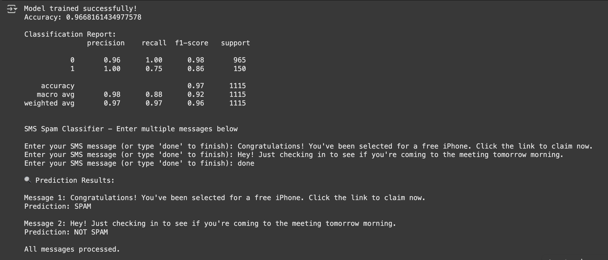

SMS Spam Detector 

This project is a simple machine learning model to detect spam messages using Python, TF-IDF, and Naive Bayes. Built as part of CodSoft’s internship program.

How it works
- Uses the SMS Spam Collection dataset
- Transforms text messages into numbers using TF-IDF
- Trains a Naive Bayes model to classify messages as SPAM or NOT SPAM

Demo

Here’s a quick look at the spam detection working in action:




## Files
- `SpamDetection.ipynb` – Notebook with training + testing
- `spam_model.pkl` – Saved trained model
- `tfidf_vectorizer.pkl` – Saved TF-IDF vectorizer
- `requirements.txt` – Python libraries needed

## Test Examples

```text
Input: Congratulations! You won a free iPhone!
Output: SPAM

Input: Hey, are we still meeting today?
Output: NOT SPAM
